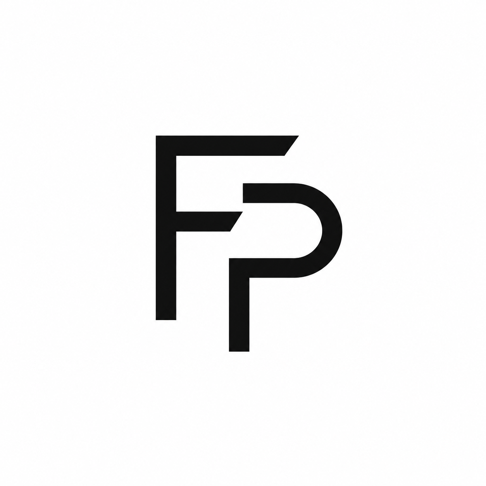
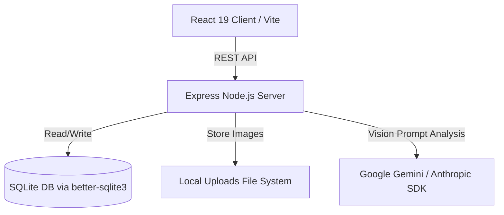

<div align="center">
  

  # FrontPocket

  **The Local-First AI Design Reference & Prompt Vault for Frontend Engineering**

  [](package.json)
  [](LICENSE)
  [](https://react.dev)
  [](https://www.typescriptlang.org/)
  [](https://tailwindcss.com/)
  [](https://vitejs.dev/)
  [](https://www.sqlite.org/)
  [](https://ai.google.dev/)

  ---

  *FrontPocket is an intelligent, privacy-focused visual design bookmarking system and AI prompt vault. Upload UI screenshots, automatically extract design taste vectors and structured code prompts using multimodal AI vision, and seamlessly build UI components with AI coding agents.*

</div>

<br/>

## 📌 Table of Contents

- [Overview](#-overview)
- [Key Features](#-key-features)
- [Architecture & Tech Stack](#-architecture--tech-stack)
- [Getting Started](#-getting-started)
  - [Prerequisites](#prerequisites)
  - [Installation](#installation)
  - [Environment Setup](#environment-setup)
  - [Running the Application](#running-the-application)
- [API Reference](#-api-reference)
- [Project Structure](#-project-structure)
- [Release Notes & Versioning](#-release-notes--versioning)
- [License](#-license)

---

## 🚀 Overview

Modern frontend engineering relies heavily on capturing visual inspiration and converting UI screenshots into functional component code. **FrontPocket** bridges this gap by offering a local-first, Pinterest-inspired workspace where developers can store design references and harness Multimodal AI Vision models (such as Google Gemini 2.5 Flash and Anthropic Claude 3.5 Sonnet) to auto-generate code-ready prompts.

Whether you're organizing design patterns, collecting UI benchmarks, or feeding detailed design parameters into AI coding assistants (like Cursor, Claude Dev, or Antigravity), FrontPocket organizes your visual assets without relying on external cloud hosting for your database.

---

## ✨ Key Features

- 🎨 **Pinterest-Grade Masonry UI**: Responsive column layout with dark and light mode support, smooth micro-interactions, and visual focus states.
- 👁️ **Multimodal AI Vision Tagging**: Automatically analyzes uploaded screenshots to infer layout structures, color palettes, typography specs, and aesthetic design "taste" tags (e.g. `#neo-brutalist`, `#glassmorphism`, `#minimalist`).
- ⚡ **Code-Ready Prompt Vault**: Generates comprehensive, copy-pasteable prompts tailored for AI coding models to recreate exact frontend designs.
- 🔒 **Local-First & Private**: Powered by a local SQLite database (`better-sqlite3`) and Express backend. All uploads stay on your filesystem.
- 🌓 **Adaptive Branding**: Built-in light and dark mode theme switching with automatic brand logo alignment (`logo_light.png` / `logo_dark.png`).
- 📁 **Multi-Format Ingestion**: Supports drag-and-drop file uploads, image picker selections, and direct clipboard image pasting.
- 🎲 **"Amaze Me" Visual Discovery**: Instantly sample design references from your gallery with random selection and visual highlights.

---

## 🏗️ Architecture & Tech Stack



### Stack Breakdown

- **Frontend**: React 19, TypeScript, Vite, Tailwind CSS v4, Lucide Icons
- **Backend**: Node.js, Express 5, TypeScript (`tsx`)
- **Database**: SQLite3 via `better-sqlite3` (WAL mode enabled)
- **AI Vision Engine**: `@google/generative-ai` (Gemini Flash 2.5) & `@anthropic-ai/sdk` (Claude 3.5 Sonnet)

---

## 🛠️ Getting Started

### Prerequisites

Ensure you have the following installed on your machine:
- **Node.js**: `v18.0.0` or higher
- **npm**: `v9.0.0` or higher

### Installation

1. Clone the repository:
   ```bash
   git clone https://github.com/JuliusDude/FrontPocket.git
   cd FrontPocket
   ```

2. Install dependencies:
   ```bash
   npm install
   ```

### Environment Setup

Create a `.env` file in the root directory by copying `.env.example`:

```bash
cp .env.example .env
```

Configure your API credentials in `.env`:

```env
# Server Port
PORT=5000

# AI Provider API Keys (At least one required for AI Vision features)
GEMINI_API_KEY=your_google_gemini_api_key_here
# ANTHROPIC_API_KEY=your_anthropic_api_key_here
```

### Running the Application

Start both the backend Express server and the Vite frontend concurrently in development mode:

```bash
npm run dev
```

- **Frontend Application**: [http://localhost:3000](http://localhost:3000)
- **Backend API**: [http://localhost:5000](http://localhost:5000)

### Production Build

To compile TypeScript and bundle assets for production:

```bash
npm run build
```

---

## 📡 API Reference

| Endpoint | Method | Description |
| :--- | :--- | :--- |
| `GET /api/screenshots` | `GET` | Fetch all screenshots (supports `tag`, `search`, and `sort` parameters) |
| `POST /api/screenshots` | `POST` | Upload single screenshot file and trigger asynchronous AI vision analysis |
| `PATCH /api/screenshots/:id` | `PATCH` | Update screenshot metadata, user prompt, notes, or tags |
| `DELETE /api/screenshots/:id` | `DELETE` | Remove screenshot entry and corresponding file |
| `POST /api/screenshots/:id/regenerate` | `POST` | Re-run AI vision analysis on an existing screenshot |
| `GET /api/tags` | `GET` | Fetch all registered design tags with usage counts |

---

## 📂 Project Structure

```
FrontPocket/
├── data/                  # SQLite Database storage (frontpocket.db)
├── public/                # Static public assets & branding logos
│   ├── logo_dark.png      # Dark theme logo
│   └── logo_light.png     # Light theme logo
├── server/                # Express backend application
│   ├── index.ts           # Server entrypoint
│   ├── db.ts              # SQLite database initialisation & queries
│   ├── vision.ts          # AI Vision provider integration (Gemini/Claude)
│   └── routes/            # API endpoints (screenshots, tags)
├── src/                   # React frontend application
│   ├── components/        # UI Components (Navbar, Gallery, Modal, Upload)
│   ├── services/          # Client API HTTP service layer
│   ├── App.tsx            # Application root state & layout
│   └── index.css          # CSS Tokens & Tailwind theme configuration
├── uploads/               # Image screenshot file storage
├── package.json           # Project manifests & scripts
└── tsconfig.json          # TypeScript compiler configuration
```

---

## 📝 Release Notes & Versioning

### v1.2.0 (Current)
- 🪄 **Dynamic Particles Background**: Implemented a responsive, performance-optimized breathing radial gradient background with floating, mouse-parallax interacting particles.
- 🎯 **Advanced Prompt Generation**: Completely overhauled the AI Vision parser to generate highly structured, Markdown-formatted architectural blueprints (Color, Typography, Motion, Spacing) for perfect frontend recreation.
- 🖱️ **Modern Custom Cursor**: Replaced native cursor with a sleek, minimalist dot that automatically scales over interactive elements.
- 🖼️ **Seamless Layering**: Replaced conflicting Framer Motion grid layouts with native Tailwind CSS transitions to permanently resolve Safari/Chrome rendering bugs.

### v1.1.0
- 🎨 **Adaptive Branding Integration**: Integrated distinct light (`logo_light.png`) and dark (`logo_dark.png`) logos for dynamic theme toggling.
- 🔒 **Unclickable Branding**: Converted the navbar brand logo into a non-clickable visual identity anchor.
- ⚡ **Strict Type Safety**: Resolved backend sorting parameters and type definitions across SQLite queries.

### v1.0.0
- 🚀 Initial release of FrontPocket with AI Vision analysis, Pinterest masonry grid, SQLite local storage, and prompt vault modal.

---

## 📄 License

This project is licensed under the **MIT License**. See the [LICENSE](LICENSE) file for details.
